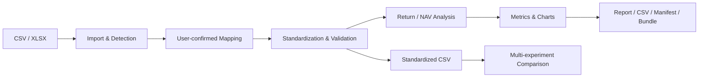
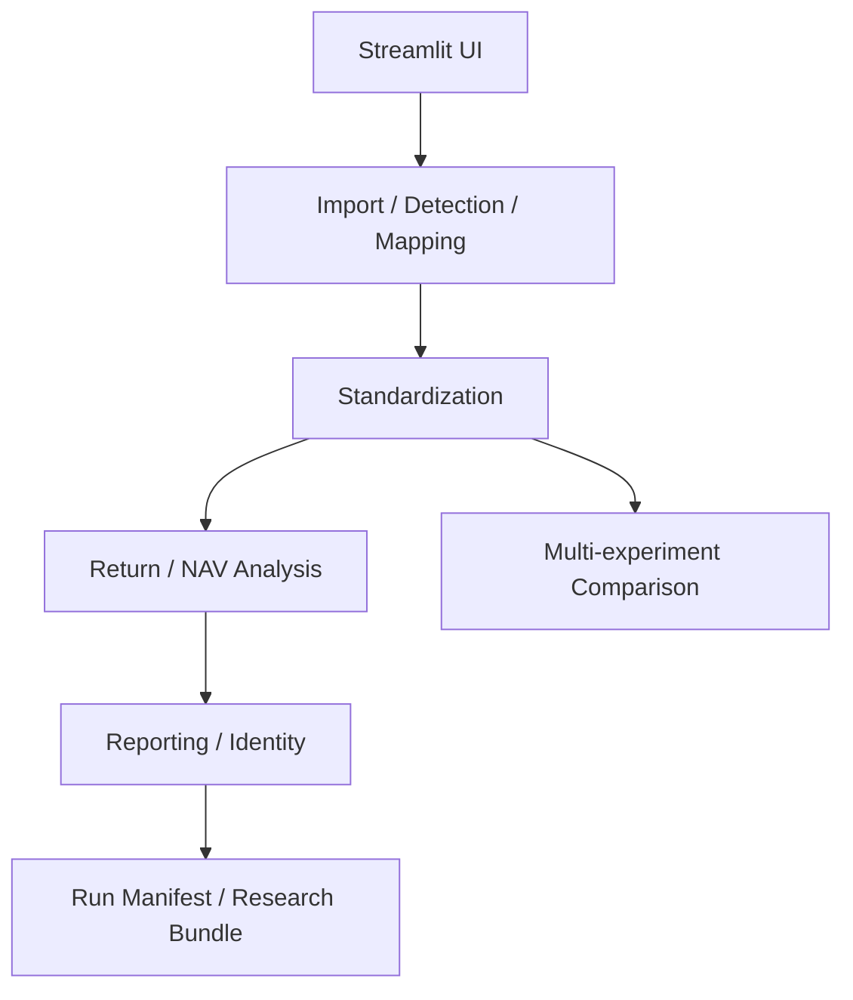

# Quant Research Workbench

> A Streamlit workspace for importing, validating, analyzing, comparing, and reproducibly
> archiving quantitative research results.

[](https://github.com/Rayne0727/quant-research-workbench/actions/workflows/ci.yml)
[](https://github.com/Rayne0727/quant-research-workbench/releases/tag/v1.0.0)
[](https://www.python.org/)
[](https://rayne-quant-research-workbench.streamlit.app)

**[Live Demo](https://rayne-quant-research-workbench.streamlit.app)** ·
**[Latest Release: v1.0.0](https://github.com/Rayne0727/quant-research-workbench/releases/tag/v1.0.0)** ·
**[User Guide](docs/USER_GUIDE.md)**

Quant Research Workbench（量化研究实验台）把量化研究结果的导入、字段核验、标准化、
Return/NAV 绩效分析、多实验比较和可复现归档放在一个受控工作流中。它面向研究记录、
结果复核和实验沟通，不构成投资建议。

## What it does

- 读取标准或通用 CSV/XLSX，检查文件、工作表、日期、数值和资源边界；
- 生成可解释的字段候选，由用户确认 mapping 和 Return/NAV 主口径；
- 通过标准化预检和严格协议后计算绩效、净值、回撤并绘图；
- 在真实共同交易日期上比较 2 至 6 个标准化实验；
- 导出 Markdown 报告、标准化 CSV、Run Manifest 和 Research Bundle；
- 提供经过大小与 SHA-256 校验的确定性合成 reference files。

## What it is not

本项目不是 backtesting engine、trading system、portfolio optimizer 或 institutional platform。
它不连接券商和实时行情，不执行交易，也不提供投资建议、用户账号、数据库或云端研究存储。

## Core workflow



通用导入不会根据高置信度建议静默确认字段。文件解释、mapping、单位和分析范围均由用户核对；
系统不会自动排序、去重、填充、删行或把 `1` 猜成 `1%`。

## Key features

| Area | Capability |
| --- | --- |
| Import | CSV UTF-8/GB18030、XLSX 工作表选择与有界安全检查 |
| Mapping | 中英文字段候选、风险解释、用户显式确认 |
| Analysis | Return/NAV 双主口径、基准收益、确定性指标与图表 |
| Comparison | 共同交易日期交集、重新归一、共同区间指标与导出 |
| Reproducibility | `analysis_id`、`run_id`、provenance、Run Manifest |
| Archiving | 固定四成员 Research Bundle 与 exact-byte SHA-256 index |
| Reliability | session-local XLSX 成功结果复用、输入变化自动失效 |

## Return, NAV, and Comparison

- **Standard Return**：`date`、`strategy_return`，可选 `benchmark_return`；收益率使用小数。
- **Standard NAV**：`date`、`nav_strat`，可选 `daily_ret`；绩效以净值及其推导收益为准。
- **Generic CSV/XLSX**：先读取、识别、确认和预检，再进入同一严格 Return/NAV 分析逻辑。
- **Comparison**：只接受本应用导出的标准化分析 CSV；不填充或插值缺失日期。

字段、校验和计算口径见 [Data Protocols](docs/DATA_PROTOCOLS.md)。

## Reproducible research

- `analysis_id` 识别相同的规范化研究内容与计算语义；
- `run_id` 识别该结果具体使用的来源、解析、mapping 和 transformation 路径；
- Run Manifest 记录身份、来源指纹、provenance、数据摘要和运行环境；
- 文件重命名不会改变研究身份，真实输入或转换路径变化会使对应结果失效。

完整 identity 与 canonicalization 合同见 [Data Protocols](docs/DATA_PROTOCOLS.md)。

## Research Bundle

单实验分析成功后可下载 `qrw_bundle_<run_id first16>.zip`，固定包含：

1. `analysis_report.md`
2. `standardized_data.csv`
3. `run_manifest.json`
4. `bundle_index.json`

`bundle_index.json` 记录前三个 artifact 实际字节的大小与 SHA-256。Bundle 默认不包含原始上传文件，
也不创建新的 identity；报告和标准化 CSV 仍可能包含敏感研究信息，分享前必须核对。

## Try the reference workflows

打开 Live Demo 的“参考文件”页，可下载以下确定性合成数据：

- Standard Return（有/无 benchmark）；
- Standard weekly NAV；
- Generic Return / Generic NAV；
- multi-sheet XLSX；
- 用于理解阻断行为的错误示例。

Comparison 页面还提供固定三实验示例和标准化 CSV 模板。参考文件只用于学习和回归，
不会自动上传、mapping 或启动分析。仓库清单见
[Reference Files](assets/reference_files/README.md)。

## Engineering quality

- 669 tests，total branch coverage 91.19%；
- 16 个核心模块通过 `mypy --strict`；
- Ruff lint 与 formatter；
- GitHub Actions、`pip-audit`、Dependabot 和 least-privilege workflow；
- 本地 quality/release gate、`pip check` 与 `compileall`。

测试数字以 v1.0.0 release-candidate 完整门禁结果为准。配置与边界见
[Engineering Quality](docs/ENGINEERING_QUALITY.md)。

## Security, privacy, and performance boundaries

- 每份上传、行数、列数、Comparison 总大小和总行数均有明确上限；
- XLSX 在解析前检查 archive member 数量、解压大小、压缩比和 worksheet 数量；
- Comparison CSV 导出会中和用户控制的 spreadsheet formula 前缀；
- CI 使用只读权限并审计运行依赖；
- 合法 XLSX 成功解析结果只在当前 session 内复用，避免无关 rerun 重复完整解析；
- 本地运行在本机进程中处理文件；公开 Demo 会把上传内容传输到云端应用进程；
- Research Bundle 默认不含 raw source，但导出 artifact 仍可能包含敏感研究数据。

不要向公开 Demo 上传凭证、个人敏感信息、商业机密或其他受限制数据。详细说明见
[Security and Privacy](docs/SECURITY_AND_PRIVACY.md)。项目支持 documented limits 内的合法数据集，
但不承诺特定设备或 Streamlit Cloud 的处理速度、资源配额或可用性。

## Architecture



项目保持模块化单体结构，不依赖数据库、API server 或外部研究数据服务。

## Local quick start

Windows PowerShell：

```powershell
python -m venv .venv
.\.venv\Scripts\python.exe -m pip install -r requirements.txt
.\scripts\run_app.bat
```

浏览器访问 <http://localhost:8501>，停止时回到终端按 `Ctrl+C`。需要运行测试时安装
`requirements-dev.txt`。

## Testing and quality gates

```powershell
.\.venv\Scripts\python.exe -m pip install -r requirements-dev.txt
.\scripts\check_quality.bat
```

准备正式发布时，在 clean worktree 运行：

```powershell
.\scripts\check_release.bat
```

质量门禁包含 Ruff、formatter、16-module strict mypy、full pytest branch coverage 和 `pip check`；
release gate 另执行 `compileall`、版本/发布文件检查和 clean-worktree 检查。

## Documentation

- [User Guide](docs/USER_GUIDE.md)
- [Data Protocols](docs/DATA_PROTOCOLS.md)
- [Engineering Quality](docs/ENGINEERING_QUALITY.md)
- [Security and Privacy](docs/SECURITY_AND_PRIVACY.md)
- [Deployment](docs/DEPLOYMENT.md)
- [v1.0.0 Release Notes](docs/RELEASE_NOTES_v1.0.0.md)
- [Release Checklist](docs/RELEASE_CHECKLIST.md)
- [Changelog](CHANGELOG.md)

历史发行说明：[v0.4.0](docs/RELEASE_NOTES_v0.4.0.md) ·
[v0.3.0](docs/RELEASE_NOTES_v0.3.0.md) ·
[v0.2.0](docs/RELEASE_NOTES_v0.2.0.md)

## License

Licensed under the [MIT License](LICENSE). Copyright (c) 2026 Rayne0727.

## Project status

v1.0.0 marks the completion of the project's first product phase. Future work is limited to bug fixes,
dependency/security maintenance, and changes driven by real user feedback; no additional feature stage is planned.
